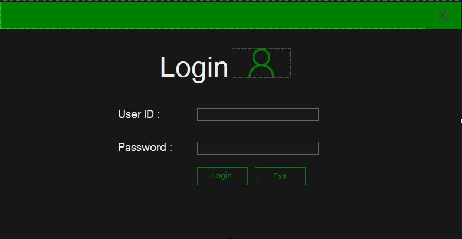
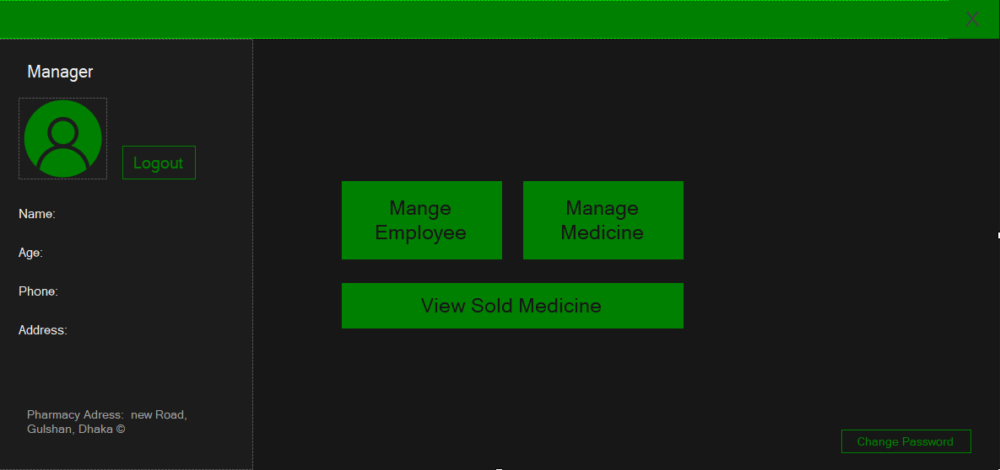
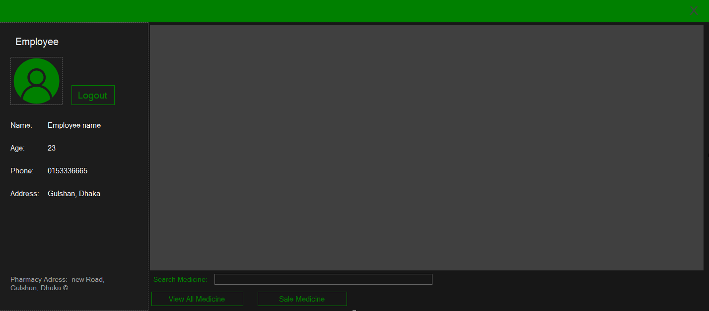
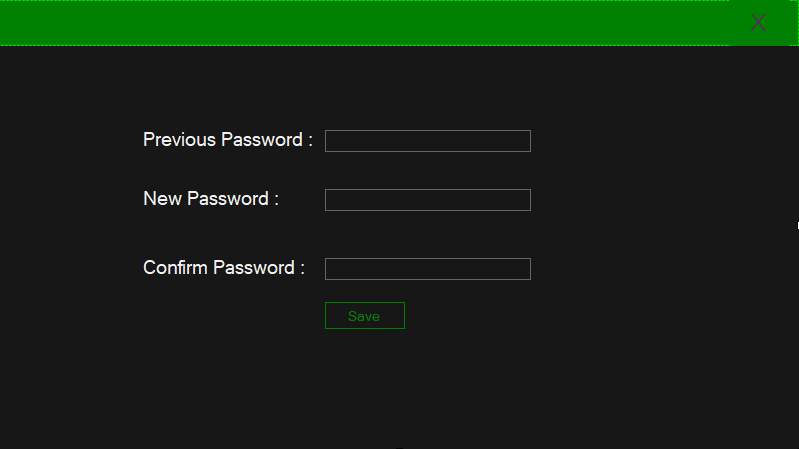
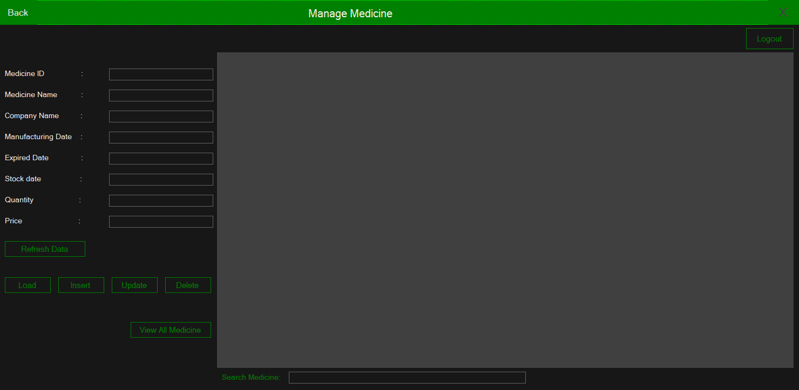

# Pharmacy Management System

A simple Phramacy management system developed in **.NET** during **Object Oriented Programming 2** course in Universisty Fall semester. As database used **Microsoft SQL server**

\_`Snapshots`:

> Login Form
> 

> Manager Form
> 

> Employee Form
> 

> Change password Form
> 

> Managing medicine by the manager
> 

**The medicine lists will be shown in the blank portion of the Employee form & Manage medicine form**
